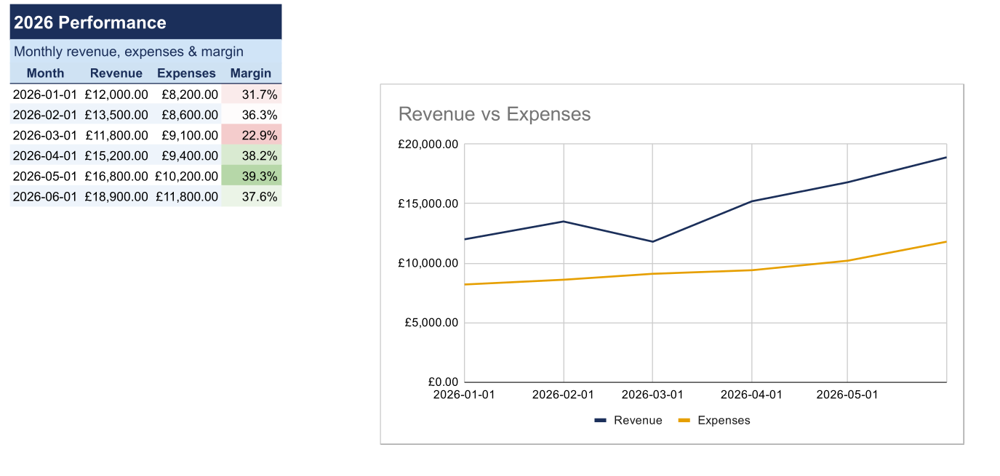

# SheetOps

A local control plane for AI agents working with Google Sheets. Reads and writes go through the Sheets API, never browser automation. Every write is gated by a patch, a dry-run, and a backup. And every sheet it builds or touches comes out **well-formatted by default** from a single design theme.



That whole layout is four commands, no manual styling:

```bash
node bin/sheetops.js style-table  --project acme --sheet Jan
node bin/sheetops.js add-chart     --project acme --sheet Jan --data-range A1:C7 --type line --title "Revenue vs Expenses"
node bin/sheetops.js conditional-format --project acme --sheet Jan --a1 D2:D7 --rule heatmap
node bin/sheetops.js add-title     --project acme --sheet Jan --title "2026 Performance" --subtitle "Monthly revenue, expenses & margin"
```

## What it does

- **Safe writes.** Patch file, dry-run preview, hash check, and Drive backup before anything touches live data. Over-100-cell, formula-overwrite, hidden-sheet, and destructive writes each need an explicit flag.
- **Presentation, automatic.** One command styles a raw table: header treatment, freeze, banding, borders, per-column alignment, and number-format inference (it detects currency / percent / date / integer columns). Plus charts, sparklines, conditional formatting, title bands, and column/row autofit.
- **Apps Script.** Pull, diff, push, and execute bound scripts via clasp and the Execution API.
- **Multi-account OAuth**, workbook snapshots with structural diff, and an audit log in every workbook.

## Quick start

```bash
git clone https://github.com/Anneo22/SheetOps.git && cd SheetOps && npm install

# One-time: OAuth desktop credentials from a GCP project (Sheets + Drive + Apps Script APIs). See SETUP.md.
node bin/sheetops.js auth --client-id YOUR_ID --client-secret YOUR_SECRET
node bin/sheetops.js init

# Connect a sheet and style it
node bin/sheetops.js add-sheet --url "https://docs.google.com/spreadsheets/d/YOUR_ID/edit" --name acme
node bin/sheetops.js style-table --project acme --sheet Sheet1
```

## Presentation layer

Styling is **theme-driven**: you apply the theme, you never pick colours per sheet. `theme.json` at the repo root holds the design tokens; a project overrides any of them with `projects/<name>/theme.json` (deep-merged).

```jsonc
{
  "header":  { "backgroundColor": "#cfe2f3", "bold": true, "horizontalAlignment": "CENTER", "wrapStrategy": "WRAP" },
  "banding": { "headerColor": "#cfe2f3", "firstBandColor": "#ffffff", "secondBandColor": "#eef4fb" },
  "numberFormats": { "currency": { "type": "CURRENCY", "pattern": "£#,##0.00" }, "percent": { "type": "PERCENT", "pattern": "0.0%" } },
  "autofit": { "maxColWidth": 320, "wrapOverCap": true },
  "chart":   { "palette": ["#1b2f5a", "#e69f00", "#009e73", "#56b4e9"] }   // Okabe-Ito, colourblind-safe
}
```

| Command | Does |
|---|---|
| `style-table` (alias `beautify`) | Header + freeze + banding + borders + alignment + number-format inference + autofit, in one shot |
| `autofit` | Fit column widths and row heights to content; cap wide columns and wrap them |
| `add-chart` | Embed a line / column / bar / area / scatter / pie chart from a data range |
| `sparkline` | An inline `=SPARKLINE` per row (word-sized trend) |
| `conditional-format` | Negatives in red, thresholds, or a heatmap |
| `add-title` | Prepend a title band and optional subtitle |
| `mark-cells` | Blue = input (literal), grey italic = computed (formula) |

Design defaults follow Tufte (no chartjunk, direct labels, bars from zero) and WCAG contrast. Full house-style guide and the post-write checklist are in [AGENTS.md](AGENTS.md) Part 9.

## All commands

Run `node bin/sheetops.js help` for every flag.

- **Connect & inspect** — `add-sheet`, `create-sheet`, `read`, `snapshot`, `compare-snapshots`, `stats`, `find`, `export`, `health`
- **Safe writes** — `dry-run-patch`, `apply-patch`, `backup`, `validate`, `format-range`
- **Presentation** — `style-table`, `autofit`, `add-chart`, `sparkline`, `conditional-format`, `add-title`, `mark-cells`, `add-tab`, `delete-tab`, `rename-tab`
- **Apps Script** — `pull-script`, `push-script`, `run-script`, `list-functions`
- **Accounts** — `auth --list` / `--switch <email>` / `--remove <email>`

## Formulas

Formulas are first-class. Every read returns both the value and the formula behind each cell; writes accept formula strings (`"=C2-D2"`) in any patch or in `create-sheet` data. `mark-cells` makes formula-driven cells visually distinct so nobody types over them.

## Write safety

| Condition | Requirement |
|---|---|
| Any write | Patch file and dry-run first |
| Over 100 cells | `confirmLarge: true` |
| Formula cell in target | `allowFormulaOverwrite: true` |
| Hidden / protected target | `allowHiddenSheet` / `allowProtected: true` |
| Row deletion or clear | `confirmDestructive: true` and a backup |
| Apps Script push | Diff shown and `--confirmed` |
| Sharing / permission change | Not permitted |

## Where it runs, and how agents use it

SheetOps is a plain Node.js CLI (Node 18+), so it runs anywhere Node runs: a terminal, a script, CI, or cron. Because it is just a shell command, it also drops into any coding agent that can run a shell, including Claude Code, Codex, Cursor, and Claude Cowork. Nothing about it is tied to one host.

Two files carry the same operating protocol, one per agent convention: **CLAUDE.md** (read by Claude Code) and **AGENTS.md** (the cross-tool convention read by Codex, Cursor, and others). They are kept byte-identical on purpose, so whichever agent picks it up follows the same onboarding, formula, presentation, and safety rules.

`sheetops.plugin` bundles that protocol as a loadable skill, so a host that supports plugins or skills (such as Claude Code or Claude Cowork) can load the rules automatically instead of you pasting them. Cold-start prompt templates are in [SESSION-STARTER-TEMPLATE.md](SESSION-STARTER-TEMPLATE.md).

## More

- [SETUP.md](SETUP.md) — GCP project and OAuth walkthrough
- [AGENTS.md](AGENTS.md) — the full agent operating protocol (onboarding, formula rules, presentation checklist, safety)
- `templates/patch-schema.json` — patch file schema
- `templates/AgentOps.gs` — optional Apps Script bridge (server-side locking, logging, guarded writes, self-test)

## License

[MIT](LICENSE) — Anneo22
